

## Contents

- [TV Series](build/tv_series.md)
- [Movies](build/movies.md)
- [Documentary](build/documentary.md)

- [8.0-8.5 :star:](#_80-85)
  - [The Triumph of the Nerds: The Rise of Accidental Empires](#the-triumph-of-the-nerds-the-rise-of-accidental-empires)
  - [The KGB, the Computer and Me](#the-kgb-the-computer-and-me)
  - [Citizenfour](#citizenfour)
  - [The Internet's Own Boy: The Story of Aaron Swartz](#the-internets-own-boy-the-story-of-aaron-swartz)
- [7.9-7.5 :star:](#_79-75)
  - [Hacking Democracy](#hacking-democracy)
  - [Zero Days](#zero-days)
  - [Indie Game: The Movie](#indie-game-the-movie)
  - [DSKNECTD](#dsknectd)
  - [Freedom Downtime](#freedom-downtime)
  - [TPB AFK: The Pirate Bay Away from Keyboard](#tpb-afk-the-pirate-bay-away-from-keyboard)
  - [Secret History of Hacking](#secret-history-of-hacking)
  - [Code 2600](#code-2600)
  - [Hackers: Wizards of the Electronic Age](#hackers-wizards-of-the-electronic-age)
- [7.0-7.5 :star:](#_70-75)
  - [We Are Legion: The Story of the Hacktivists](#we-are-legion-the-story-of-the-hacktivists)
  - [The Singularity](#the-singularity)
  - [Terms and Conditions May Apply](#terms-and-conditions-may-apply)
  - [Code Rush](#code-rush)
  - [Revolution OS](#revolution-os)
  - [We Live in Public](#we-live-in-public)
  - [Startup.com](#startupcom)
  - [Deep Web](#deep-web)
  - [Steal This Film](#steal-this-film)
  - [Print the Legend](#print-the-legend)
- [6.9-6.5 :star:](#_69-65)
  - [Google and the World Brain](#google-and-the-world-brain)
  - [We Steal Secrets: The Story of WikiLeaks](#we-steal-secrets-the-story-of-wikiLeaks)
  - [Downloaded](#downloaded)
  - [Talhotblond](#talhotblond)
  - [Silicon Cowboys](#silicon-cowboys)
  - [Home Page](#home-page)
  - [The Hacker Wars](#the-hacker-wars)
- [6.0-6.5 :star:](#_60-65)
  - [Hackers Wanted](#hackers-wanted)
  - [Hackers: Outlaws and Angels](#hackers-outlaws-and-angels)
  - [Hackers Are People Too](#hackers-are-people-too)
  - [DEFCON: The Documentary](#defcon-the-documentary)
  - [War for the Web](#war-for-the-web)
- [5.0-5.5 :star:](#_50-55)
  - [Hacker](#hacker)

### 8.0-8.5

#### The Triumph of the Nerds: The Rise of Accidental Empires
:star: 8.5

> Three part documentary that shows the insight look at the history of computers, from its rise in the 1970s to the beginning of the Dot-com boom of the late 1990s.

* Year: 1996
* Country: USA
* [_IMDb_](https://www.imdb.com/title/tt0115398/)

#### The KGB, the Computer and Me
:star: 8.1

> In 1986, astronomer turned computer scientist Clifford Stoll had just started working on a computer system at the Lawrence Berkeley Laboratory when he noticed a 75-cent discrepancy between the charges printed by two accounting programs responsible for charging people for machine use. Intrigued, he deduced that the system was being hacked, and he determined to find the culprit. This is the re-enactment of how he tracked down KGB cracker Markus Hess through the Ethernet to Hannover, Germany, as is told in his best-selling book _ The Cuckoo's Egg: Tracking a Spy Through the Maze of Computer Espionage_ (1989). Stoll has become a celebrity for being, as he terms himself, "a computer contrarian."

* Year: 1990
* Country: USA
* [_IMDb_](https://www.imdb.com/title/tt0308449/)

#### Citizenfour
:star: 8.1

> A documentarian and a reporter travel to Hong Kong for the first of many meetings with Edward Snowden.

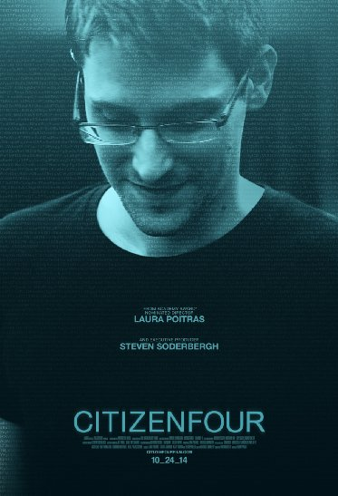
* Year: 2014
* Country: USA, Germany, UK
* [_IMDb_](https://www.imdb.com/title/tt4044364/)

#### The Internet's Own Boy: The Story of Aaron Swartz
:star: 8.1

> The story of programming prodigy and information activist Aaron Swartz, who took his own life at the age of 26

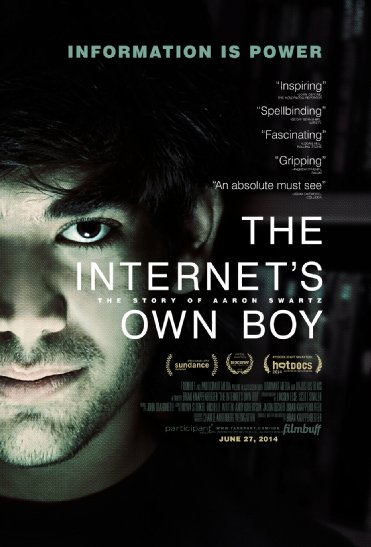
* Year: 2014
* Country: USA
* [_IMDb_](https://www.imdb.com/title/tt3268458/)

### 7.9-7.5

#### Hacking Democracy
:star: 7.9

> This is a ground breaking documentary investigating allegations of election fraud during the 2004 U.S. presidential election. A group of concern citizens heading up watchdog organizations investigate the 2004 election in the wake of these allegations on the 2000 presidential election which ended up decided in the Supreme Court. These ordinary citizens investigate voter machine hardware and software security holes in systems used in numerous states including Ohio, Florida and California. They demonstrate with the help of a computer programmer how easy it is to change the numbers tallied on Diebold voting machines that count ballots. They are forced to the extreme of picking the trash at a Florida county warehouse to discover ballot tapes with numbers that mismatched the official election authority records, giving George Bush a lead in the numbers.

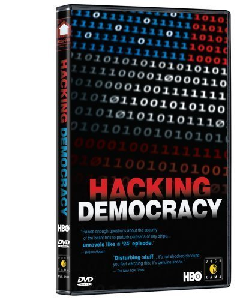
* Year: 2006
* Country: UK
* [_IMDb_](https://www.imdb.com/title/tt0808532/)

#### Zero Days
:star: 7.8

> A documentary focused on Stuxnet, a piece of self-replicating computer malware that the U.S. and Israel unleashed to destroy a key part of an Iranian nuclear facility, and which ultimately spread beyond its intended target.

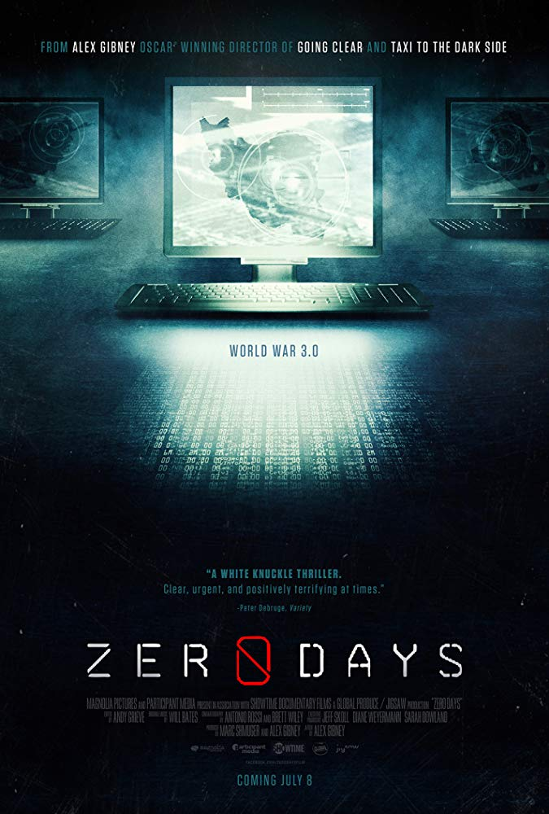
* Year: 2016
* Country: USA
* [_IMDb_](https://www.imdb.com/title/tt5446858/)

#### Indie Game: The Movie
:star: 7.7

> A documentary that follows the journeys of indie game developers as they create games and release those works, and themselves, to the world.

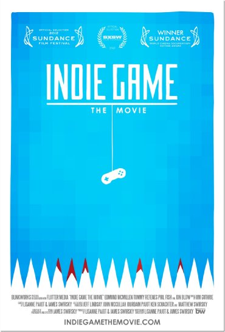

* Year: 2012
* Country: Canada
* [_IMDb_](https://www.imdb.com/title/tt1942884/)

#### DSKNECTD
:star: 7.7

> An exploration into how smart phones, social media, and the Internet are profoundly changing the way we interact and experience each other - for the good and for the bad.

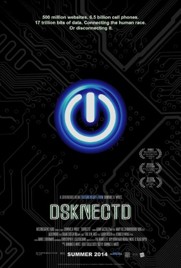
* Country: USA
* [_IMDb_](https://www.imdb.com/title/tt1942884/)

#### Freedom Downtime
:star: 7.4

> A feature length documentary about the Free Kevin movement and the hacker world.

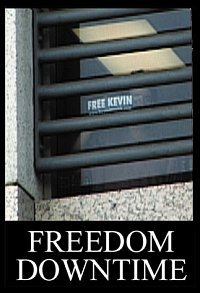
* Year: 2001
* Country: USA
* [_IMDb_](https://www.imdb.com/title/tt0309614/)

#### TPB AFK: The Pirate Bay Away from Keyboard
:star: 7.5

> An intellectual freedoms documentary based around the interpersonal triumphs, and defeats of the three main characters against the largest industry in the known universe. The media industry.

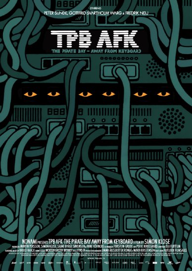
* Year: 2013
* Country: Sweden, Denmark, Norway, UK, Netherlands, Germany
* [_IMDb_](https://www.imdb.com/title/tt2608732/)

#### Secret History of Hacking
:star: 0

* Year: 2001
* Country: USA
* [_IMDb_](https://www.imdb.com/title/tt2338277/)

#### Code 2600
:star: 7.4

> CODE 2600 documents the Info-Tech Age, told by the events and people who helped build and manipulate it. It explores the impact this new connectivity has on our ability to remain human while maintaining our personal privacy and security.

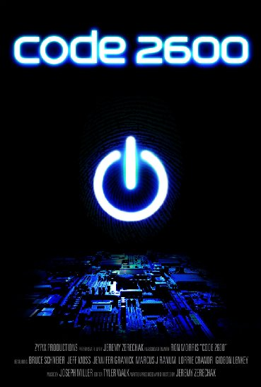
* Year: 2011
* Country: USA
* [_IMDb_](https://www.imdb.com/title/tt1830538/)

#### Hackers: Wizards of the Electronic Age
:star: 7.6

> All interviews in this documentary were shot over a long weekend at a 1984 hacker conference by the Whole Earth Catalog editors Stewart Brand and Kevin Kelley in Sausalito, California. The event itself (the hacker conference) was inspired by Steven Levy's classic book "Hackers - Heroes of the Computer Revolution".

* Year: 1984
* Country: USA
* [_IMDb_](https://www.imdb.com/title/tt1191116/)

#### The Secret Rules of Modern Living: Algorithms
 :star: 7.5

> Professor Marcus du Sautoy demystifies the hidden world of algorithms and reveals where these 2,000-year-old problem solvers came from, how they work, and what they have achieved.

* Year: 2015
* Country: UK
* [_IMDb_](https://www.imdb.com/title/tt5818010/)

### 7.0-7.5

#### We Are Legion: The Story of the Hacktivists
:star: We_Are_Legion_Score

> Documentary on the workings and beliefs of the self-described "hacktivist" collective, Anonymous.

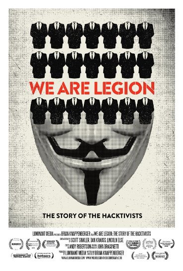
* Year: 2012
* Country: USA, UK
* [_IMDb_](https://www.imdb.com/title/tt2177843)

#### The Singularity
:star: 7.2

> Within the coming decades we will be able to create computers with greater than human intelligence, bio-engineer our species, and redesign matter through nanotechnology. How will these technologies change what it means to be human?

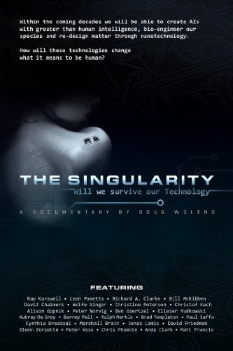
* Year: 2012
* Country: USA
* [_IMDb_](https://www.imdb.com/title/tt2073120/)

#### Terms and Conditions May Apply
:star: 7.4

> A documentary that exposes what corporations and governments learn about people through Internet and cell phone usage, and what can be done about it ... if anything.

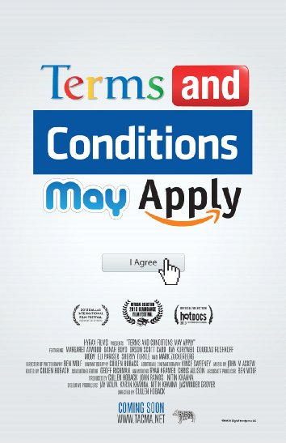
* Year: 2013
* Country: USA
* [_IMDb_](https://www.imdb.com/title/tt2084953/)

#### Code Rush
:star: Code_Rush_Score

> Code Rush follows the people of Netscape Communications during an intense period in 1998, when it was all but certain that Microsoft had already won control of the Internet user's desktop. When all hope seems fading, a group of dedicated developers work their hardest to push out a very special release.

* Year: 2013
* Country: USA
* [_IMDb_](https://www.imdb.com/title/tt0499004)

#### Revolution OS
:star: 7.3

> While Microsoft may be the biggest software company in the world, not every computer user is a fan of their products, or their way of doing business. While Microsoft's Windows became the most widely used operating system for personal computers in the world, many experts took issue with Microsoft's strict policies regarding licensing, ownership, distribution, and alteration of their software. The objections of many high-profile technology experts, most notably Richard Stallman, led to what has become known as "the Open Source Movement," which is centered on the belief that computer software should be free both in the economic and intellectual senses of the word. Eventually, one of Stallman's admirers, Linus Torvalds, created a new operating system called Linux, a freely distributed software which many programmers consider to be markedly superior to Windows. Revolution OS is a documentary that examines the genesis of the Open Source Movement, and explores and explains the technical and intellectual issues involved in a manner understandable to computer aficionados and non-techheads alike.

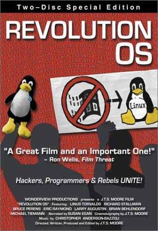
* Year: 2001
* Country: USA
* [_IMDb_](https://www.imdb.com/title/tt0308808/)

#### We Live in Public
:star: 7.2

> A documentary focusing on the life of dot-com entrepreneur Josh Harris, and his exploits over the last decade.

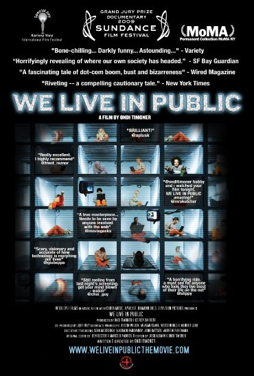
* Year: 2009
* Country: USA
* [_IMDb_](https://www.imdb.com/title/tt0498329/)

#### Startup.com
:star: 7.1

> Traces the birth and failure of new media company govWorks.com.

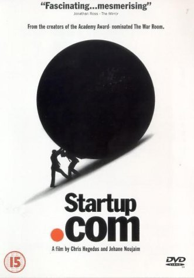
* Year: 2001
* Country: USA
* [_IMDb_](https://www.imdb.com/title/tt0256408/)

#### Deep Web
:star: 7

> A feature documentary that explores the rise of a new Internet; decentralized, encrypted, dangerous and beyond the law.

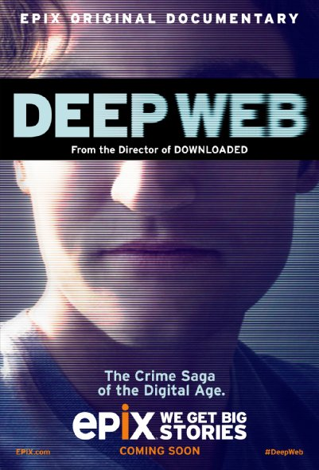
* Year: 2015
* Country: USA
* [_IMDb_](https://www.imdb.com/title/tt3312868/)

#### Steal This Film
:star: 7

> Steal This Film is part one of a series, documenting the movement against intellectual property produced by The League of Noble Peers and released via the BitTorrent peer-to-peer protocol.

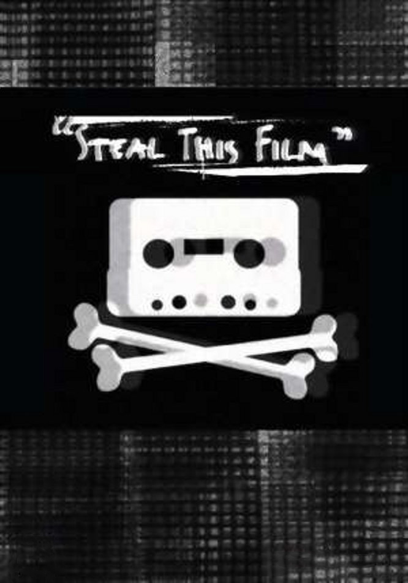
* Year: 2006
* Country: UK, Germany, Sweden
* [_IMDb_](https://www.imdb.com/title/tt1422757/)

#### Print the Legend
:star: 7

> Print the Legend is a 2014 documentary film and Netflix Original focused on the 3D printing revolution.

* Year: 2014
* Country: USA
* [_IMDb_](https://www.imdb.com/title/tt3557464/)

### 6.9-6.5

#### Google and the World Brain
:star: 6.8

> The most ambitious project ever conceived on the Internet: Google's master plan to scan every book in the world and the people trying to stop them. Google say they are building a library for mankind, but they also have other intentions.

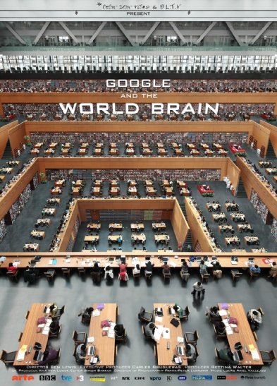
* Year: 2013
* Country: Spain, UK, Germany
* [_IMDb_](https://www.imdb.com/title/tt2551516/)

#### We Steal Secrets: The Story of WikiLeaks
:star: 6.9

> A documentary that details the creation of Julian Assange's controversial website, which facilitated the largest security breach in U.S. history.

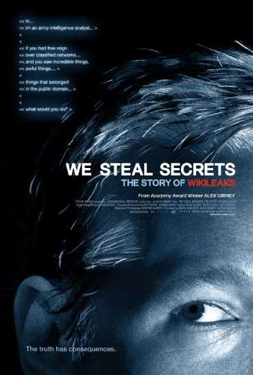
* Year: 2013
* Country: USA
* [_IMDb_](https://www.imdb.com/title/tt1824254/)

#### Downloaded
:star: 6.9

> A documentary that explores the downloading revolution; the kids that created it, the bands and the businesses that were affected by it, and its impact on the world at large.

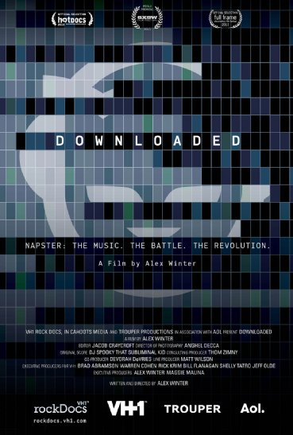
* IMDB rating: 6.8
* Year: 2013
* Country: USA
* [_IMDb_](https://www.imdb.com/title/tt2033981/)

#### Talhotblond
:star: 6.8

> This is the true story of a love triangle that takes place entirely online. Lies lead to murder in real life, as a teenage vixen (screen name 'talhotblond') lures men into her web. Revealing a shocking true crime story that shows the Internet's power to unleash our most dangerous fantasies.

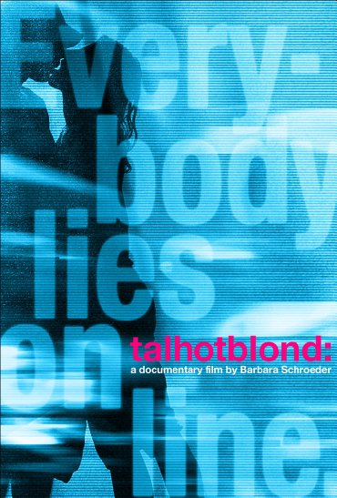
* Year: 2009
* Country: USA
* [_IMDb_](https://www.imdb.com/title/tt1370889/)

#### Silicon Cowboys
:star: 6.8

> Three friends dream up the Compaq portable computer at a Texas diner in 1981, and soon find themselves battling mighty IBM, for PC supremacy. Their improbable journey altered the future of computing and shaped the world we now know.

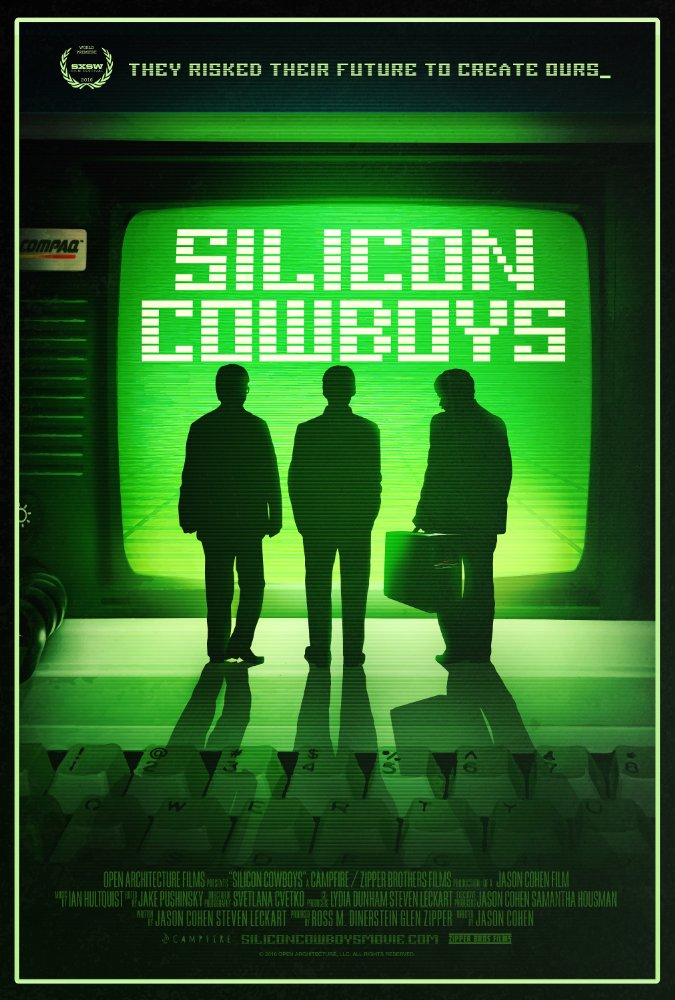
* Year: 2016
* Country: USA
* [_IMDb_](https://www.imdb.com/title/tt4938484/)

#### Home Page
:star: 6.8

* Year: 1998
* Country: Germany, USA
* [_IMDb_](https://www.imdb.com/title/tt0144969/)

#### The Hacker Wars
:star: 6.6

> Ripped from international headlines, The Hacker Wars takes you to the front lines of the high-stakes battle over the fate of the Internet, freedom and privacy

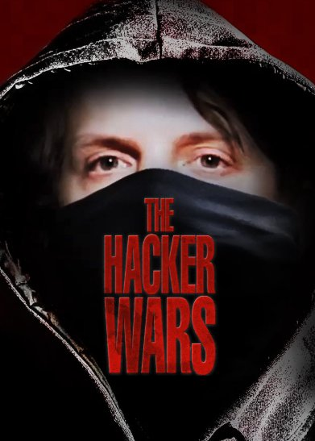
* Year: 2014
* Country: USA
* [_IMDb_](https://www.imdb.com/title/tt4047350/)

### 6.0-6.5

#### Hackers Wanted
:star: 6.4

> This film both follows the hacking adventures of famous hacker Adrian Lamo, and uses them as a microcosm for the macrocosm of struggles faced by emerging trends of thought - from the criminal to the philosophical.

* Year: 2009
* Country: USA
* [_IMDb_](https://www.imdb.com/title/tt2292707/)

#### Hackers: Outlaws and Angels
:star: 6.2

* Year: 2002
* Country: UK
* [_IMDb_](https://www.imdb.com/title/tt1977808/)

#### Hackers Are People Too
:star: 6

> Hackers do laundry. Hackers like movies. Hackers are people and could be your neighbors, your brother, your friends. Presenting a portrait of the hacking community, created by the community themselves, this film breaks down negative stereotypes by letting hackers show you that they are really no different from anyone else. Delving into areas such as the way hackers think, what is hacking, hackers in the media, and women in the security/hacking field, this film will have you questioning your ideas about what a 'hacker' really is.

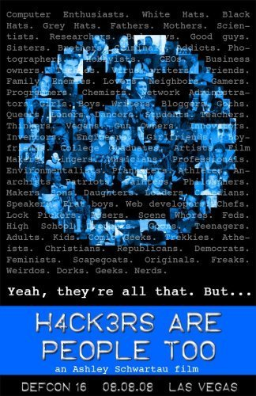
* Year: 2008
* Country: USA
* [_IMDb_](https://www.imdb.com/title/tt1279942/)

#### DEFCON: The Documentary
:star: 5.8

> DEFCON is the world's largest hacking conference, held in Las Vegas, Nevada. In 2012 it was held for the 20th time. The conference has strict no-filming policies, but for DEFCON 20, a documentary crew was allowed full access to the event. The film follows the four days of the conference, the events and people (attendees and staff), and covers history and philosophy behind DEFCON's success and unique experience.

* Year: 2013
* Country: USA
* [_IMDb_](https://www.imdb.com/title/tt3010462/)

#### War for the Web
:star: 0

> War for the Web demystifies the physical infrastructure of the Internet and uses that as a basis to explore the issues of ownership and competition in the broadband marketplace, privacy, and security.

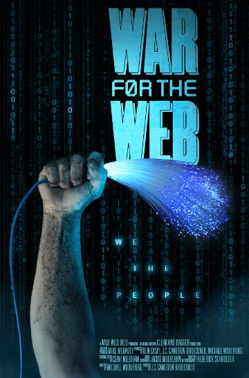
* Year: 2015
* Country: USA
* [_IMDb_](https://www.imdb.com/title/tt2390367/)

### 5.0-5.5

#### Hacker
:star: 5.6

* Year: 2010
* Country: Germany
* [_IMDb_](https://www.imdb.com/title/tt1769296/)

## Contributing
Your contributions are always welcome! Please take a look at the [contribution guidelines](CONTRIBUTING.md) first.

## License

To the extent possible under law, [Aleksandr Filatov](https://alfilatov.com) has waived all copyright and related or neighboring rights to this work.
