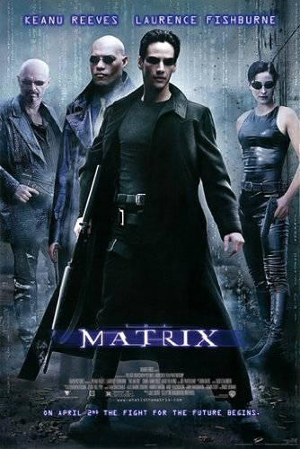
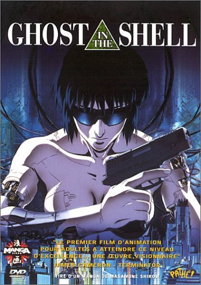
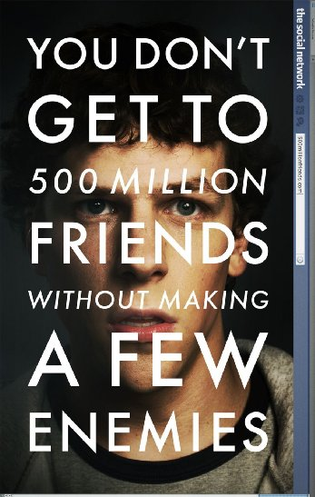
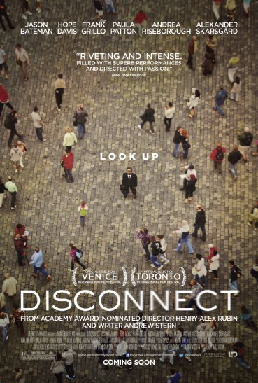
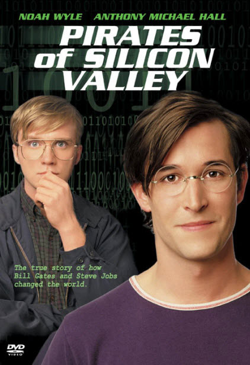
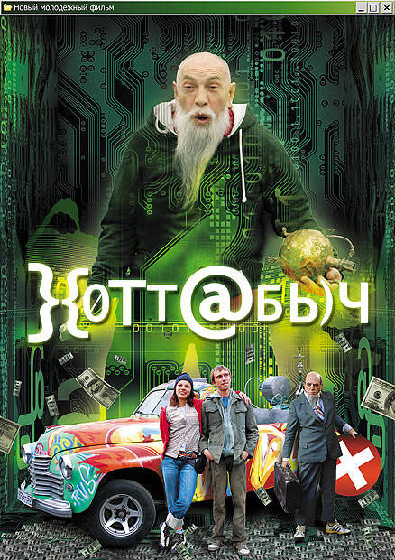
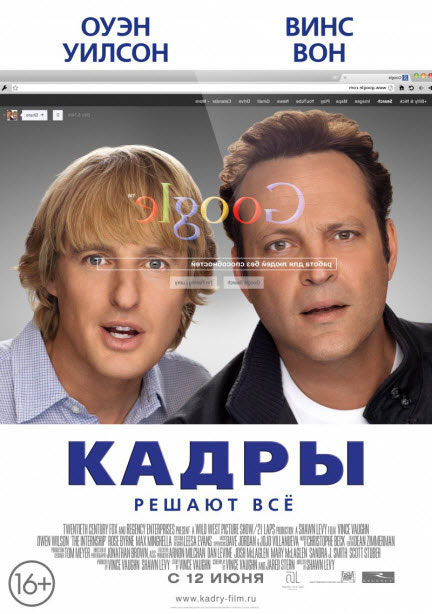
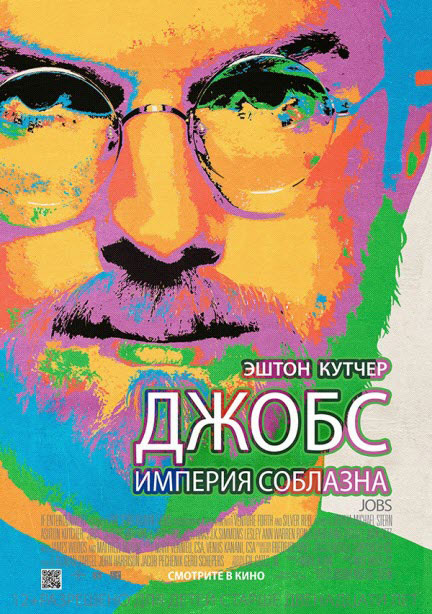
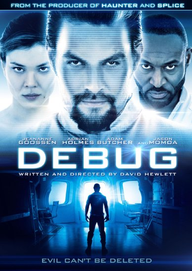

[Matrix](http://www.imdb.com/title/tt0133093/)

* IMDB rating: 8.7
* Year: 1999
* Country: USA, Australia

A computer hacker learns from mysterious rebels about the true nature of his reality and his role in the war against its controllers.

[Ghost in the shell](http://www.imdb.com/title/tt0113568/)

* IMDB rating: 8.0
* Year: 1995
* Country: Japan

A female cyborg cop and her partner hunt a mysterious and powerful hacker called the Puppet Master.

[The Social Network](http://www.imdb.com/title/tt1285016)

* IMDB rating: 7.8
* Year: 2010
* Country: USA

Harvard student Mark Zuckerberg creates the social networking site that would become known as Facebook, but is later sued by two brothers who claimed he stole their idea, and the cofounder who was later squeezed out of the business.

[Disconnect](http://www.imdb.com/title/tt1433811/)

* IMDB rating: 7.6
* Year: 2012
* Country: USA

A drama centered on a group of people searching for human connections in today's wired world.

[Pirates of Silicon Valley](http://www.imdb.com/title/tt0168122)

* IMDB rating: 7.2
* Year: 1999
* Country: USA

History of Apple and Microsoft.

[Khottabych](http://www.imdb.com/title/tt0466043)

* IMDB rating: 6.5
* Year: 2006
* Country: Russia

[The Internship](http://www.imdb.com/title/tt2234155)

* IMDB rating: 6.3
* Year: 2013
* Country: USA

Two salesmen whose careers have been torpedoed by the digital age find their way into a coveted internship at Google, where they must compete with a group of young, tech-savvy geniuses for a shot at employment.

[Jobs](http://www.imdb.com/title/tt2357129/)

* IMDB rating: 5.9
* Year: 2013
* Country: USA

The story of Steve Jobs' ascension from college dropout into one of the most revered creative entrepreneurs of the 20th century.

[Startap](http://www.imdb.com/title/tt3274728/)

* IMDB rating: 4.5
* Year: 2014
* Country: Russia

[Debug](http://www.imdb.com/title/tt2769184)

* IMDB rating: 4.4
* Year: 2014
* Country: Canada

Six young computer hackers sent to work on a derelict spaceship, are forced to match wits with a vengeful artificial intelligence that would kill to be human.

