

### [Matrix](http://www.imdb.com/title/tt0133093/)

* IMDB rating: 8.7
* Year: 1999
* Country: USA, Australia

A computer hacker learns from mysterious rebels about the true nature of his reality and his role in the war against its controllers.

### [Ghost in the shell](http://www.imdb.com/title/tt0113568/)

* IMDB rating: 8.0
* Year: 1995
* Country: Japan

A female cyborg cop and her partner hunt a mysterious and powerful hacker called the Puppet Master.

### [The Social Network](http://www.imdb.com/title/tt1285016)

* IMDB rating: 7.8
* Year: 2010
* Country: USA

Harvard student Mark Zuckerberg creates the social networking site that would become known as Facebook, but is later sued by two brothers who claimed he stole their idea, and the cofounder who was later squeezed out of the business.

### [Office Space](http://www.imdb.com/title/tt0151804/)

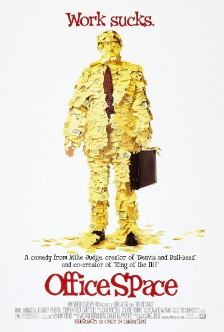

* IMDB rating: 7.8
* Year: 1999
* Country: USA

Three company workers who hate their jobs decide to rebel against their greedy boss.

### [Minority Report](http://www.imdb.com/title/tt0181689)

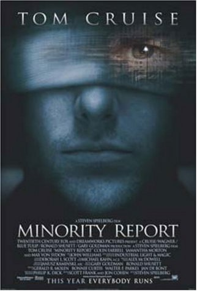

* IMDB rating: 7.7
* Year: 2002
* Country: USA

In a future where a special police unit is able to arrest murderers before they commit their crimes, an officer from that unit is himself accused of a future murder.

### [Disconnect](http://www.imdb.com/title/tt1433811/)

* IMDB rating: 7.6
* Year: 2012
* Country: USA

A drama centered on a group of people searching for human connections in today's wired world.

### [23](http://www.imdb.com/title/tt0126765/)

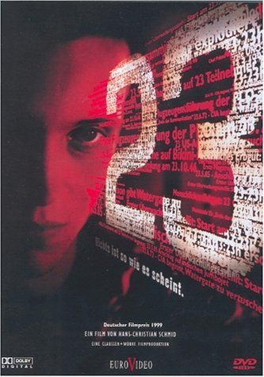

* IMDB rating: 7.3
* Year: 1998
* Country: Germany

The movie's plot is based on the true story of a group of young computer hackers from Hannover, Germany. In the late 1980s the orphaned Karl Koch invests his heritage in a flat and a home computer. At first he dials up to bulletin boards to discuss conspiracy theories inspired by his favorite novel, R.A. Wilson's "Illuminatus", but soon he and his friend David start breaking into government and military computers. Pepe, one of Karl's rather criminal acquaintances senses that there is money in computer cracking - he travels to east Berlin and tries to contact the KGB.

### [Cyberbully](http://www.imdb.com/title/tt4135218/)

* IMDB rating: 7.3
* Year: 2015
* Country: UK

A British teenager is forced by a computer hacker to do his bidding. If she refuses, the hacker will leak compromising photos of her to the public.

### [Enemy of the State](http://www.imdb.com/title/tt0120660/)

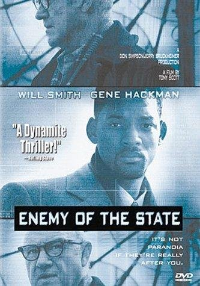

* IMDB rating: 7.3
* Year: 1998
* Country: USA

A lawyer becomes a target by a corrupt politician and his NSA goons when he accidentally receives key evidence to a serious politically motivated crime.

### [Live Free or Die Hard](http://www.imdb.com/title/tt0337978/)

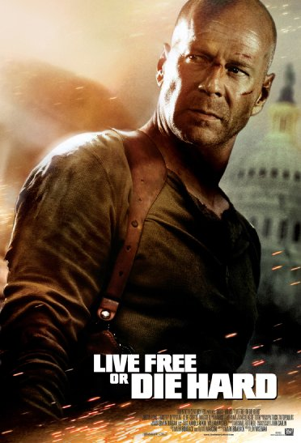

* IMDB rating: 7.2
* Year: 2007
* Country: USA, UK

John McClane and a young hacker join forces to take down master cyber-terrorist Thomas Gabriel in Washington D.C.

### [Pirates of Silicon Valley](http://www.imdb.com/title/tt0168122)

* IMDB rating: 7.2
* Year: 1999
* Country: USA

History of Apple and Microsoft.

### [GoldenEye](http://www.imdb.com/title/tt0113189/)

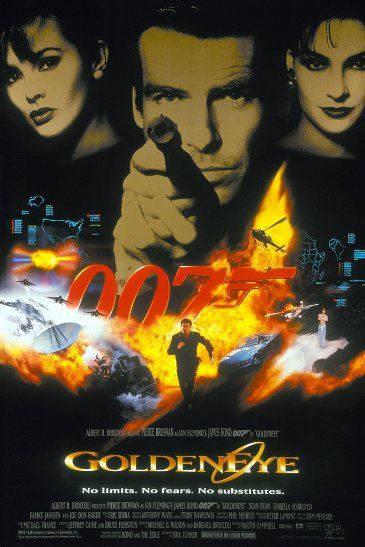

* IMDB rating: 7.2
* Year: 1995
* Country: UK, USA

James Bond teams up with the lone survivor of a destroyed Russian research center to stop the hijacking of a nuclear space weapon by a fellow agent believed to be dead.

### [Sneakers](http://www.imdb.com/title/tt0105435/)

* IMDB rating: 7.1
* Year: 1992
* Country: USA

Complex but lighthearted thriller about computers and cryptography, government and espionage, secrets and deception and betrayal.

### [In the Realm of the Hackers](http://www.imdb.com/title/tt1199631/)

* IMDB rating: 7.1
* Year: 2003
* Country: Australia

In the late 1980s two Melbourne teenage computer hackers known as Electron and Phoenix stole a restricted computer security list and used it to break into some of the world's most classified and supposedly secure computer systems. So fast and widespread was the attack no-one could work out how it had happened, until one of the hackers called the New York Times to brag about it. Ten years after their arrest, this dramatized documentary reveals not only how they did it but why, taking us headlong into the clandestine, risky but intoxicating world of the computer underground.

### [WarGames](http://www.imdb.com/title/tt0086567/)

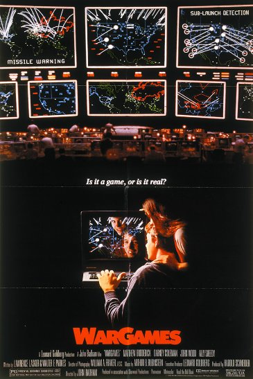

* IMDB rating: 7.1
* Year: 1983
* Country: USA

A young man finds a back door into a military central computer in which reality is confused with game-playing, possibly starting World War III.

### [The Thirteenth Floor](http://www.imdb.com/title/tt0139809/)

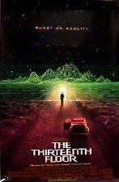

* IMDB rating: 7.0
* Year: 1999
* Country: Germany, USA

Computer scientist Hannon Fuller has discovered something extremely important. He's about to tell the discovery to his colleague, Douglas Hall, but knowing someone is after him, the old man leaves a letter in the computer generated parallel world his company has created (which looks like the 30's with seemingly real people with real emotions). Fuller is murdered in our real world the same night, and his colleague is suspected. Douglas discovers a bloody shirt in his bathroom and he cannot recall what he was doing the night Fuller was murdered. He logs into the system in order to find the letter, but has to confront the unexpected. The truth is harsher than he could ever imagine...

### [Real Genius](http://www.imdb.com/title/tt0089886/)

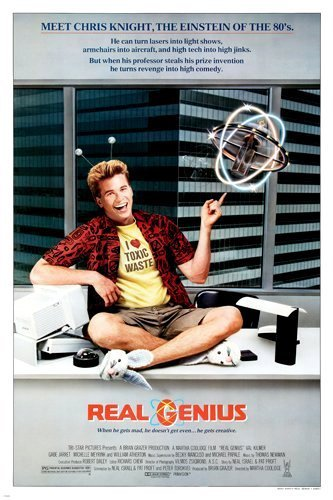

* IMDB rating: 7.0
* Year: 1985
* Country: USA

Teenage geniuses deal with their abilities while developing a laser.

### [The Score](http://www.imdb.com/title/tt0227445/)

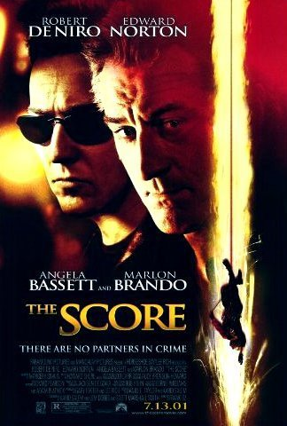

* IMDB rating: 6.8
* Year: 2001
* Country: USA, Germany

An aging thief hopes to retire and live off his ill-gotten wealth when a young kid convinces him into doing one last heist.

### [eXistenZ](http://www.imdb.com/title/tt0120907/)

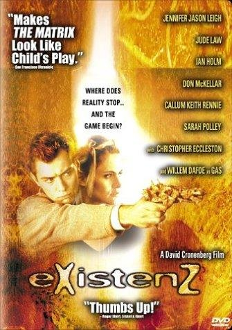

* IMDB rating: 6.8
* Year: 1999
* Country: Canada, UK

A game designer on the run from assassins must play her latest virtual reality creation with a marketing trainee to determine if the game has been damaged.

### [TRON](http://www.imdb.com/title/tt0084827/)

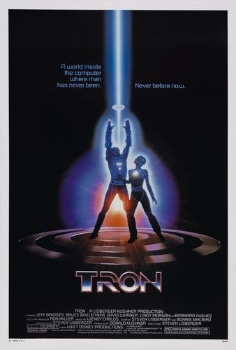

* IMDB rating: 6.8
* Year: 1982
* Country: USA

A computer hacker is abducted into the digital world and forced to participate in gladiatorial games where his only chance of escape is with the help of a heroic security program.

### [TRON: Legacy](http://www.imdb.com/title/tt1104001/)

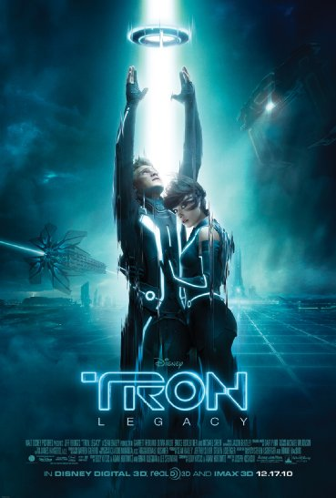

* IMDB rating: 6.8
* Year: 2010
* Country: USA

The son of a virtual world designer goes looking for his father and ends up inside the digital world that his father designed. He meets his father's corrupted creation and a unique ally who was born inside the digital world.

### [Underground: The Julian Assange Story](http://www.imdb.com/title/tt2357453/)

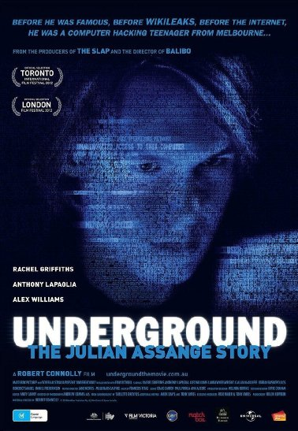

* IMDB rating: 6.8
* Year: 2012
* Country: Australia

A look at the early career of Wikileaks founder, Julian Assange.

### [Eagle Eye](http://www.imdb.com/title/tt1059786/)

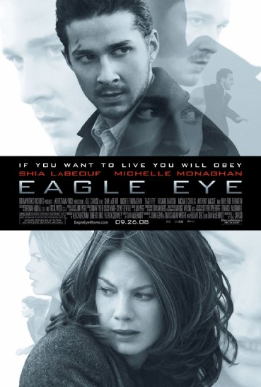

* IMDB rating: 6.6
* Year: 2008
* Country: USA, Germany

Jerry and Rachel are two strangers thrown together by a mysterious phone call from a woman they have never met. Threatening their lives and family, she pushes Jerry and Rachel into a series of increasingly dangerous situations, using the technology of everyday life to track and control their every move.

### [Weird Science](http://www.imdb.com/title/tt0090305/)

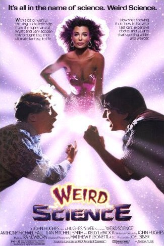

* IMDB rating: 6.6
* Year: 1985
* Country: USA

Two high school nerds attempt to create the perfect woman, but she turns out to be more than that.

### [Foolproof](http://www.imdb.com/title/tt0356614/)

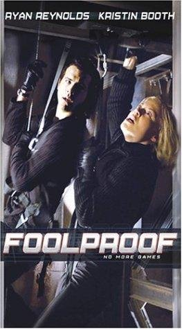

* IMDB rating: 6.6
* Year: 2003
* Country: Canada

Kevin, Sam and Rob are founding members of a theoretical group which pulls off heists. Leo, a gangster, blackmails them into pulling off a real multi-million dollar heist. Now it's up to them to get out alive.

### [Swordfish](http://www.imdb.com/title/tt0244244/)

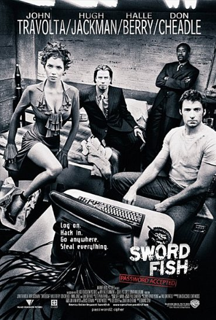

* IMDB rating: 6.5
* Year: 2001
* Country: USA, Australia

A secretive renegade counter-terrorist co-opts the world's greatest hacker (who is trying to stay clean) to steal billions in US Government dirty money.

### [Brainstorm](http://www.imdb.com/title/tt0085271)

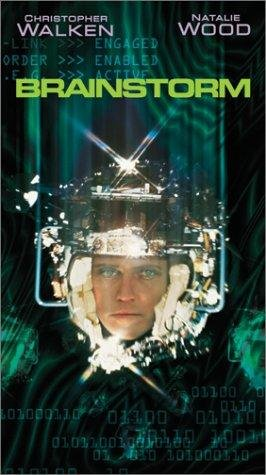

* IMDB rating: 6.5
* Year: 1983
* Country: USA

Brilliant researchers Lillian Reynolds and Michael Brace have developed a system of recording and playing back actual experiences of people. Once the capability of tapping into "higher brain functions" is added in, and you can literally jump into someone else's head and play back recordings of what he or she was thinking, feeling, seeing, etc., at the time of the recording, the applications for the project quickly spiral out of control. While Michael Brace uses the system to become close again to Karen Brace, his estranged wife who also works on the project, others start abusing it for intense sexual experiences and other logical but morally questionable purposes. The government tries to kick Michael and Lillian off the project once the vast military potential of the technology is discovered. It soon becomes obvious that the government is interested in more than just missile guidance systems. The lab starts producing mind torture recordings and other psychosis inducing material. When one of the researchers dies and tapes the experience of death, Michael is convinced that he must playback this tape to honor the memory of the researcher and to become enlightened. When another researcher dies during playback the tape is locked away and Michael has to fight against his former colleagues and the government lackeys that now run his lab in order to play back and confront the "scariest thing any of us will ever face" - death itself.

### [Khottabych](http://www.imdb.com/title/tt0466043)

* IMDB rating: 6.5
* Year: 2006
* Country: Russia

### [Takedown](http://www.imdb.com/title/tt0159784/)

* IMDB rating: 6.3
* Year: 2000
* Country: USA

This film is based on the story of the capture of computer hacker "Kevin Mitnick".

### [The Internship](http://www.imdb.com/title/tt2234155)

* IMDB rating: 6.3
* Year: 2013
* Country: USA

Two salesmen whose careers have been torpedoed by the digital age find their way into a coveted internship at Google, where they must compete with a group of young, tech-savvy geniuses for a shot at employment.

### [Untraceable](http://www.imdb.com/title/tt0880578/)

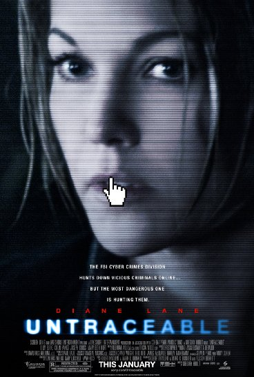

* IMDB rating: 6.2
* Year: 2008
* Country: USA

FBI agent Jennifer Marsh is tasked with hunting down a seemingly untraceable serial killer who posts live videos of his victims on the Internet. As time runs out, the cat and mouse chase becomes more personal.

### [Hackers](http://www.imdb.com/title/tt0113243/)

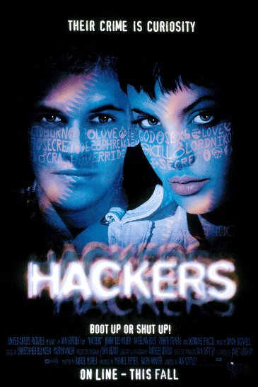

* IMDB rating: 6.2
* Year: 1995
* Country: USA

A young boy is arrested by the U.S. Secret Service for writing a computer virus and is banned from using a computer until his 18th birthday. Years later, he and his new-found friends discover a plot to unleash a dangerous computer virus, but they must use their computer skills to find the evidence while being pursued by the Secret Service and the evil computer genius behind the virus.

### [The Fifth Estate](http://www.imdb.com/title/tt1837703/)

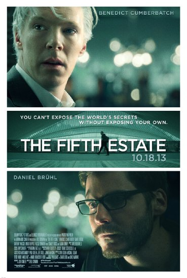

* IMDB rating: 6.1
* Year: 2013
* Country: USA, India, Belgium

A dramatic thriller based on real events that reveals the quest to expose the deceptions and corruptions of power that turned an Internet upstart into the 21st century's most fiercely debated organization.

### [One Point O](http://www.imdb.com/title/tt0317042/)

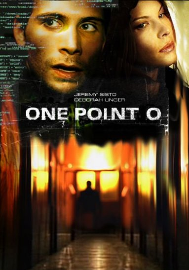

* IMDB rating: 6.1
* Year: 2004
* Country: USA, Romania, Iceland

After receiving mysterious empty packages inside his apartment, a young computer-programmer begins a personal investigation into their origins.

### [Antitrust](http://www.imdb.com/title/tt0218817/)

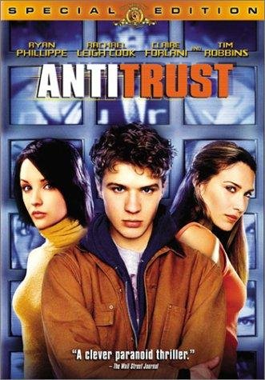

* IMDB rating: 6.1
* Year: 2001
* Country: USA

A computer programmer's dream job at a hot Portland-based firm turns nightmarish when he discovers his boss has a secret and ruthless means of dispatching anti-trust problems.

### [Disclosure](http://www.imdb.com/title/tt0109635/)

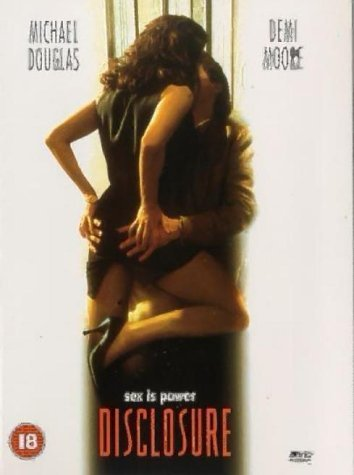

* IMDB rating: 6.0
* Year: 1994
* Country: USA

A computer specialist is sued for sexual harassment by a former lover turned boss who initiated the act forcefully, which threatens both his career and his personal life.

### [The Computer Wore Tennis Shoes](http://www.imdb.com/title/tt0065566/)

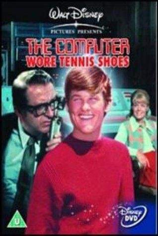

* IMDB rating: 6.0
* Year: 1969
* Country: USA

Some college students manage to persuade the town's big businessman, A. J. Arno, to donate a computer to their college. When the problem- student, Dexter Riley, tries to fix the computer, he gets an electric shock and his brain turns to a computer; now he remembers everything he reads. Unfortunately, he also remembers information which was in the computer's memory, like the illegal business Arno is involved in.

### [Jobs](http://www.imdb.com/title/tt2357129/)

* IMDB rating: 5.9
* Year: 2013
* Country: USA

The story of Steve Jobs' ascension from college dropout into one of the most revered creative entrepreneurs of the 20th century.

### [The Net](http://www.imdb.com/title/tt0113957/)

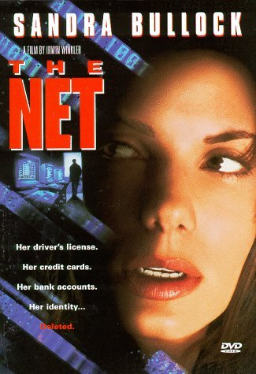

* IMDB rating: 5.8
* Year: 1995
* Country: USA

A computer programmer stumbles upon a conspiracy, putting her life and the lives of those around her in great danger.

### [Gamer](http://www.imdb.com/title/tt1034032/)

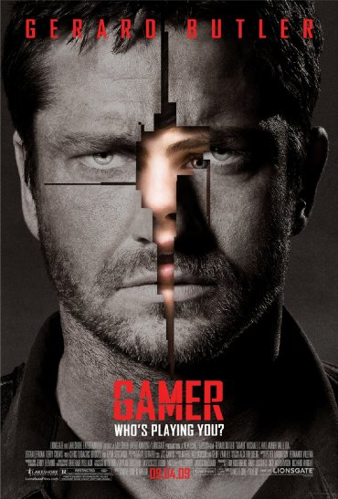

* IMDB rating: 5.8
* Year: 2009
* Country: USA

In a future mind-controlling game, death row convicts are forced to battle in a 'Doom'-type environment. Convict Kable, controlled by Simon, a skilled teenage gamer, must survive thirty sessions in order to be set free. Or won't he?

### [Firewall](http://www.imdb.com/title/tt0408345/)

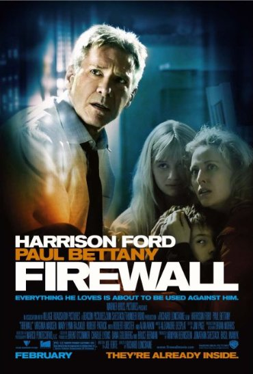

* IMDB rating: 5.8
* Year: 2006
* Country: USA, Australia

A security specialist is forced into robbing the bank that he's protecting, as a bid to pay off his family's ransom.

### [Virtuosity](http://www.imdb.com/title/tt0114857/)

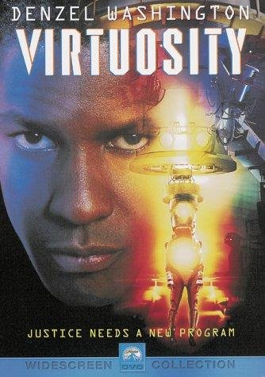

* IMDB rating: 5.5
* Year: 1995
* Country: USA

A virtual-reality serial killer manages to escape into the real world.

### [Johnny Mnemonic](http://www.imdb.com/title/tt0113481/)

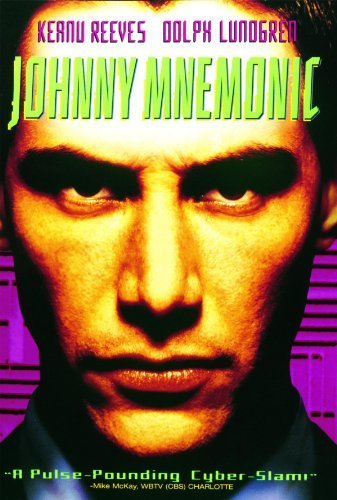

* IMDB rating: 5.5
* Year: 1995
* Country: Canada, USA

A data courier, literally carrying a data package inside his head, must deliver it before he dies from the burden or is killed by the Yakuza.

### [The Lawnmower Man](http://www.imdb.com/title/tt0104692/)

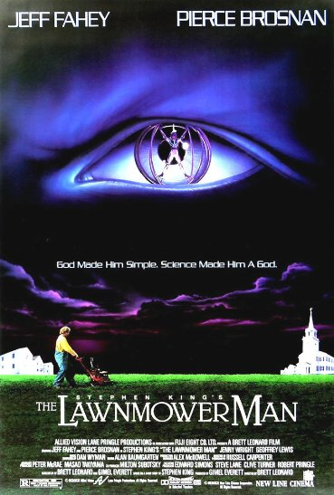

* IMDB rating: 5.4
* Year: 1992
* Country: UK, USA, Japan

A simple man is turned into a genius through the application of computer science.

### [Blackhat](http://www.imdb.com/title/tt2717822)

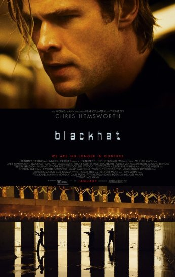

* IMDB rating: 5.4
* Year: 2015
* Country: USA

A furloughed convict and his American and Chinese partners hunt a high-level cybercrime network from Chicago to Los Angeles to Hong Kong to Jakarta.

### [Open Windows](http://www.imdb.com/title/tt2409818/)

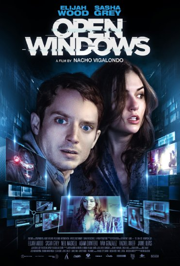

* IMDB rating: 5.2
* Year: 2014
* Country: Spain, USA

A jilted fan soon finds himself pulled into a deadly game of cat-and-mouse after he accepts the opportunity to spy on his favorite actress via his laptop.

### [Algorithm](http://www.imdb.com/title/tt3293462)

* IMDB rating: 5.1
* Year: 2014
* Country: USA

A freelance computer hacker discovers a mysterious government computer program. He breaks into the program and is thrust into a revolution.

### [Startap](http://www.imdb.com/title/tt3274728/)

* IMDB rating: 4.5
* Year: 2014
* Country: Russia

### [Debug](http://www.imdb.com/title/tt2769184)

* IMDB rating: 4.4
* Year: 2014
* Country: Canada

Six young computer hackers sent to work on a derelict spaceship, are forced to match wits with a vengeful artificial intelligence that would kill to be human.

### [Reboot](http://www.imdb.com/title/tt2090594/)

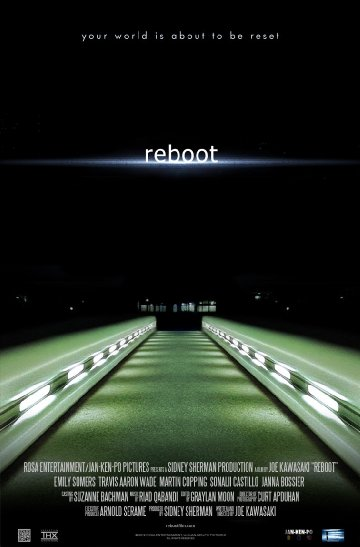

* IMDB rating: 4.1
* Year: 2012
* Country: USA

A young female hacker awakens from a traumatic event that she scarcely remembers, and an iPhone glued to her hand. On the phone, a countdown is ticking away to zero. What happens at zero? Who is she, and why has she become an extension of the device? As the minutes tick away, our heroine must race against time to put the pieces together before the mysterious, pending zero-hour strikes.

### [Hacker](http://www.imdb.com/title/tt3173594)

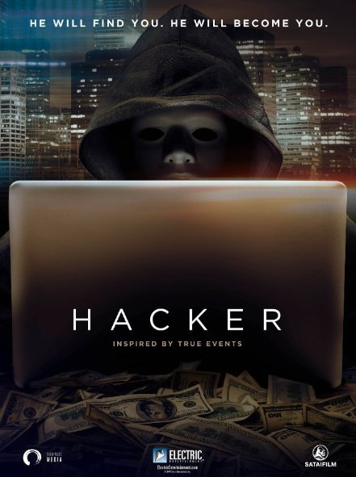

* IMDB rating: Not yet released
* Year: 2015
* Country: USA, Thailand, Kazakhstan, Hong Kong, Canada

Alex, an immigrant from Ukraine comes to Canada and becomes involved with an online criminal organization called Darkweb. He learns to rip off credit cards, ATMs, break into banks and eventually the stock market. He engages a network of service staff to help collect information, and partners with a guy named Sye, and a girl named Kira, to help sell the online-bought merchandise. What starts off as a way to help his parents financially, soon becomes a personal vendetta against the entire banking system, when his mother is fired from her job at the bank. Inspired by true events.