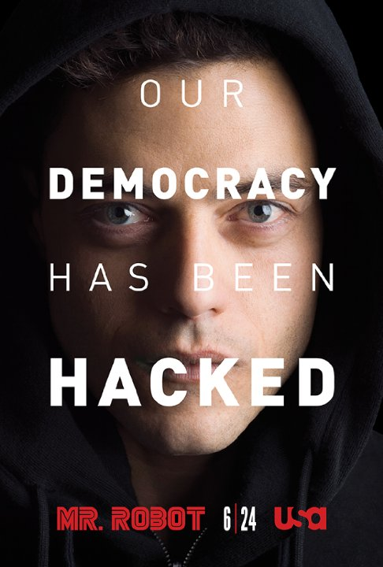
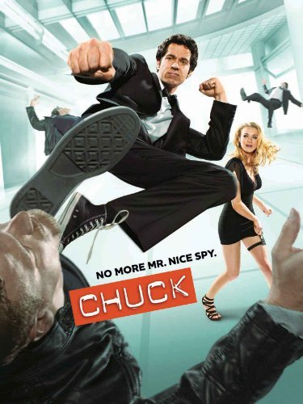
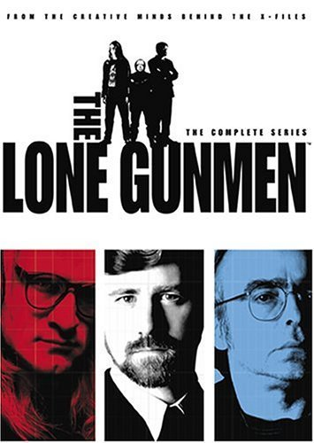
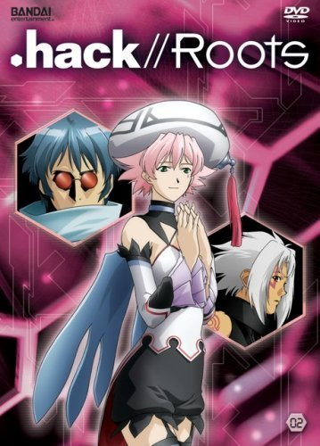

## [Movies](movies.md)
## [Documentary](documentary.md)
## [TV Series](tv_series.md)

- [8.6 :star:](#_86)
  - [Mr. Robot](#mr-robot)
  - [The IT Crowd](#the-it-crowd)
  - [Silicon Valley](#silicon-valley)
- [8.5 :star:](#_85)
  - [Person of Interest](#person-of-interest)
- [8.2 :star:](#_82)
  - [Chuck](#chuck)
- [7.5 :star:](#_75)
  - [The Lone Gunmen](#the-lone-gunmen)
- [6.6 :star:](#_66)
  - [ .hack//Roots](#hack_roots)

### 8.6

#### Mr. Robot
> Follows a young computer programmer who suffers from social anxiety disorder and forms connections through hacking. He's recruited by a mysterious anarchist, who calls himself Mr. Robot.

* Year: 2015-
* Country: USA
* [_IMDb_](http://www.imdb.com/title/tt4158110)

#### The IT Crowd
> The comedic adventures of a rag-tag group of technical support workers at a large corporation.

* Year: 2006–2013
* Country: UK
* [_IMDb_](http://www.imdb.com/title/tt0487831)

#### Silicon Valley
> In the high-tech gold rush of modern Silicon Valley, the people most qualified to succeed are the least capable of handling success. A comedy partially inspired by Mike Judge's own experiences as a Silicon Valley engineer in the late 1980s.

* Year: 2014-
* Country: USA
* [_IMDb_](http://www.imdb.com/title/tt2575988/)

### 8.5

#### Person of Interest
> An ex-assassin and a wealthy programmer save lives via a surveillance AI that sends them the identities of civilians involved in impending crimes. However, the details of the crimes--including the civilians' roles--are left a mystery. 

* Year: 2011-2016
* Country: USA
* [_IMDb_](http://www.imdb.com/title/tt1839578/)

### 8.2

#### Chuck
> When a twenty-something computer geek inadvertently downloads critical government secrets into his brain, the C.I.A. and the N.S.A. assign two Agents to protect him, and exploit such knowledge, turning his life upside down.

* Year: 2007-2012
* Country: USA
* [_IMDb_](http://www.imdb.com/title/tt0934814/)

### 7.5

#### The Lone Gunmen
> Spin-off of The X-Files featuring the trio of computer-hacking conspiracy geeks popularly known as The Lone Gunmen. Never ones to stray far from the center of corporate and government intrigue, the threesome of John Byers, Melvin Frohike, and Richard Langly play like a misguided Mission Impossible team, embarking on a series of comic adventures that simultaneously highlight their genius and ineptitude. While their newfound independence inspires them to investigate even the most shadowy of conspiracies, their social skills remain stagnant, which only makes their lives more difficult when they learn their chief competitor in the "information business" is the brilliant and beautiful Yves Adele Harlow. Perpetually short of funds to publish The Lone Gunmen newspaper, Byers, Frohike and Langly begrudgingly take on Jimmy Bond as an unlikely benefactor who bankrolls their missions and joins them in their investigations to uncover the truth.

* Year: 2001-
* Country: Canada, USA
* [_IMDb_](http://www.imdb.com/title/tt0243069)

### 6.6

#### .hack//Roots
> In 2015, CC Corporation's data-center caught on fire destroying "The World". By splicing in data from what would have been another project, CC Corp. was able to rebuild the game. In 2016, "The World R:2" was released. .hack//Roots covers the time Haseo spent with Shino and Ovan in the guild known as the Twilight Brigade, before the .hack//G.U. PS2 games.

* Year: 2006-
* Country: Japan
* [_IMDb_](http://www.imdb.com/title/tt0807655/)

# Contributing
Your contributions are always welcome! Please take a look at the [contribution guidelines](CONTRIBUTING.md) first.

# License
MIT © [Aleksandr Filatov](https://alfilatov.com)
